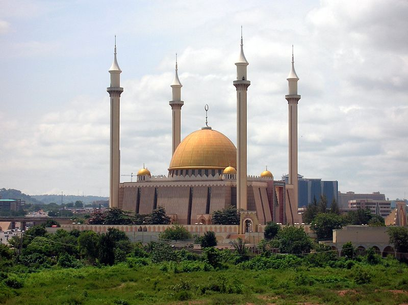
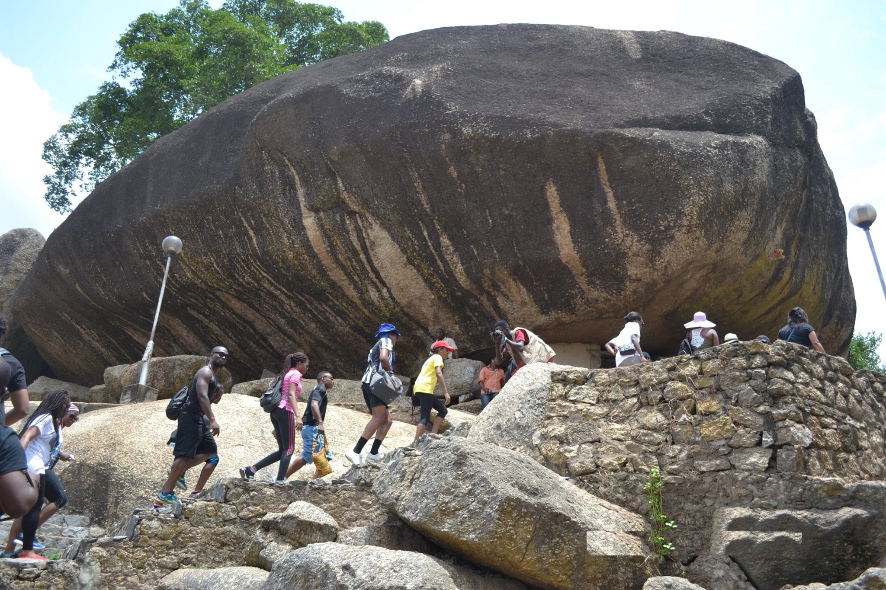
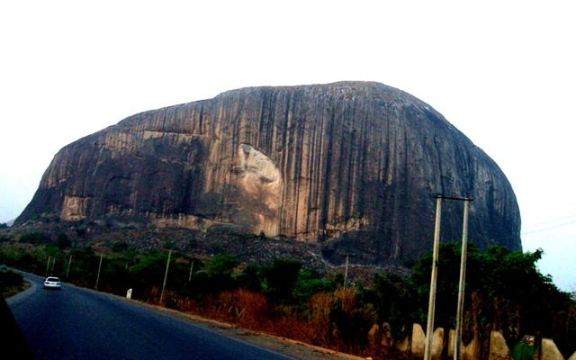

##Data set of Nigerian Monuments

This is a small sample dataset of three monuments for trying out simple machine learning CNN.
* National mosque
* Olumo Rock
* Zuma Rock 

These images were scrapped of the internet using Bing Image Search API."# recognising-nigerian-monuments" 
